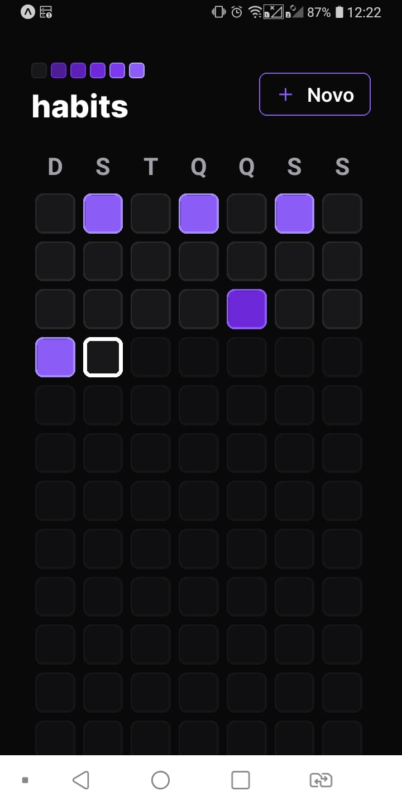
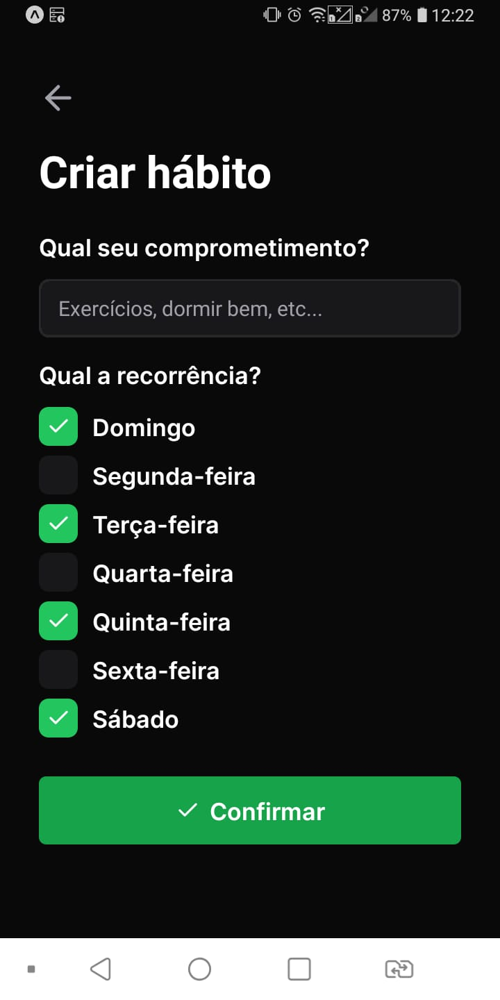

 <p align='center'></p>

 <h1 align="center">NLW Setup Mobile</h1>

 <p align='center'>


 
</p>

## 🚀 Tecnologias
Esse projeto está utilizando as seguintes tecnologias:
    

- [React](https://pt-br.reactjs.org/)
- [ReactNative](https://reactnative.dev/)
- [Typescript](https://www.typescriptlang.org/)  
- [NativewindCSS](https://tailwindcss.com/)


## ⚙️ Funcionalidades
- Criar hábitos
- Listar hábitos diários
- Marcar e desmarcar como concluído
- Exibir porcentagem concluída
- Exibir diferentes cores baseado na porcentagem concluída

## 🎲 Como utilizar
### Clone esse repositório
```bash
git clone https://github.com/Savio-Anjos/nlw-Setup-mobile.git

```
### Navegue até o diretório mobile
```bash 
cd mobile
```

### Instale as dependências
```bash
npm i
```
```bash
yarn
```
### Inicie a aplicação 
```bash
npx expo start
```

## 🖼️ Layout
<p align="center"></p>
<p align="center"></p>


<p>Criado com 💙 por <a href='https://github.com/Savio-Anjos/' target='_blank'>Sávio Anjos</a></p>

---

<p>Obs: Essa aplicação depende do server disponível na versão web do projeto:<a href='https://github.com/Savio-Anjos/nlw-Setup' target='_blank'> Web</a></p>

---


 
